<!-- [](https://www.flightsimulator.com/)[](https://www.asobostudio.com/)  -->

# Documentation for Microsoft Flight Simulator glTF 2.0 Importer and Exporter for Blender

First of all, this addon adds some panels and options needed to have a correct model export ready to be used in the sim.

## Summary
1. [Materials Propreties](#Materials-Propreties)  
2. [Lights Propreties](#lights-propreties)
3. [Objects Propreties](#objects-propreties)
4. [Multi-Exporter glTF 2.0](#multi-exporter-gltf-20)


## Materials Propreties:
- When you select an object in Blender, you can access the material properties from the Object Ribbon on the right, under the Material Properties button. 

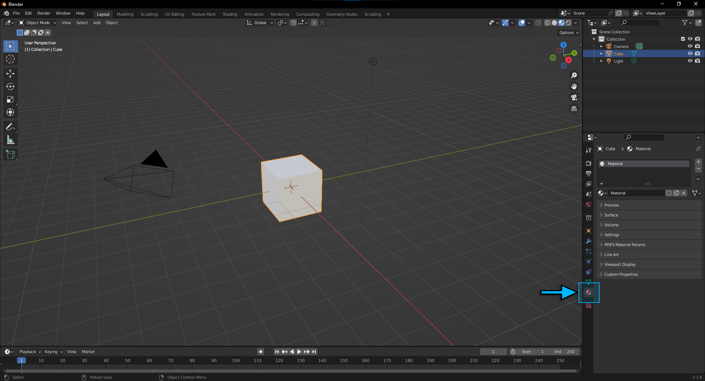
- When you want to export a model dedicated to Microsoft Flight Simulator, you need to set a Flight Simulator material to it:  

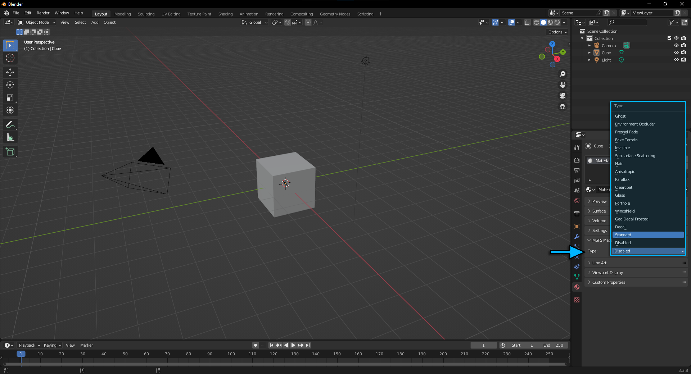

- When you set a Flight Simulator Material, you have to edit the material propreties from the MSFS Material Params only, if you edit the shader nodes it will break the export :

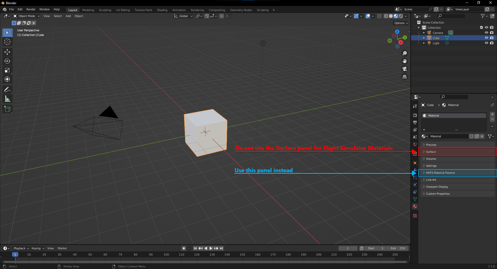

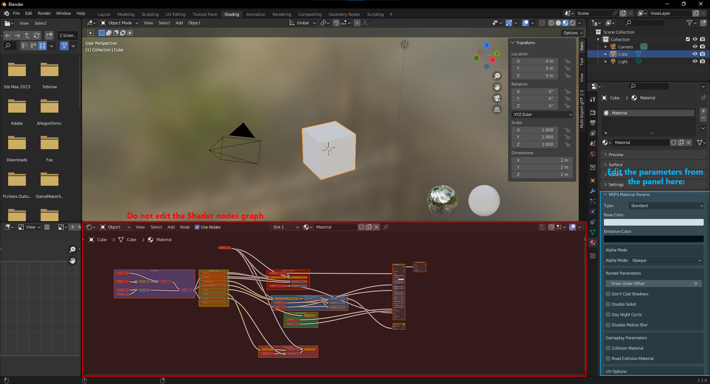

:warning: DO NOT EDIT THE SHADER PART

- If you want to learn more about the different materials listed and how to use them, you can refer to the SDK documentation on materials here: https://docs.flightsimulator.com/html/Asset_Creation/3DS_Max_Plugin/Materials.htm

## Lights Propreties

Once you have created your model in Blender and are ready to start adding lights you can add a spot light and see a list of new parameters to be setted:

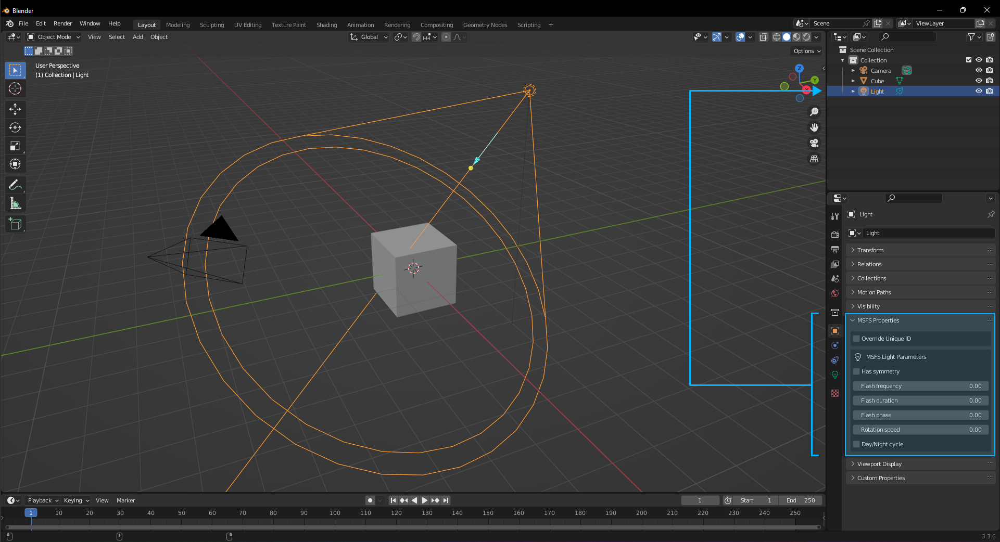

If you want to lean more on what are these parameters, you can refer to the SDK Documentation on lights here: https://docs.flightsimulator.com/html/Asset_Creation/3DS_Max_Plugin/Lights.htm

## Objects Propreties
When you select an object, you can override its Unique ID that will be interprated by the sim using this checkbox here:

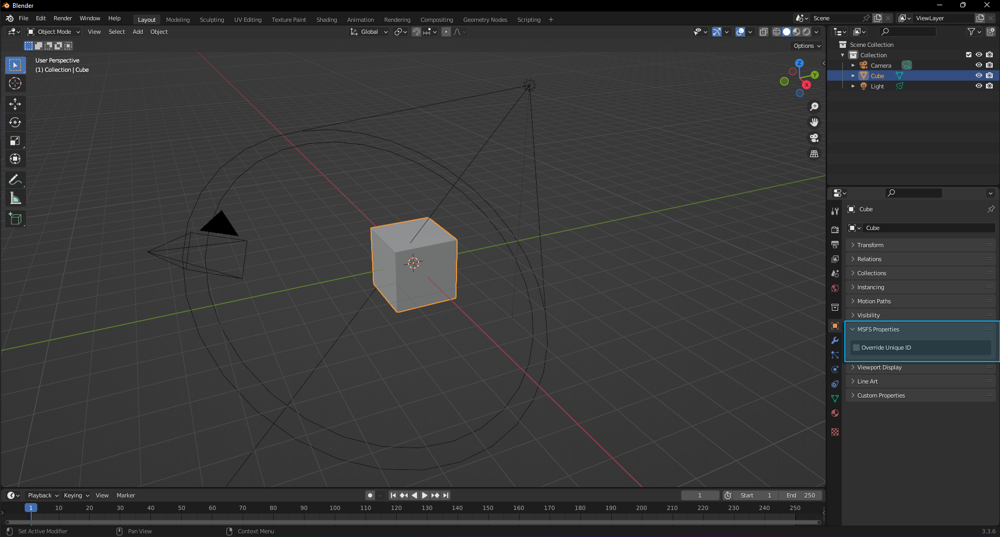

## Multi-Exporter glTF 2.0
- To export your model you need to use the multi-exporter view :

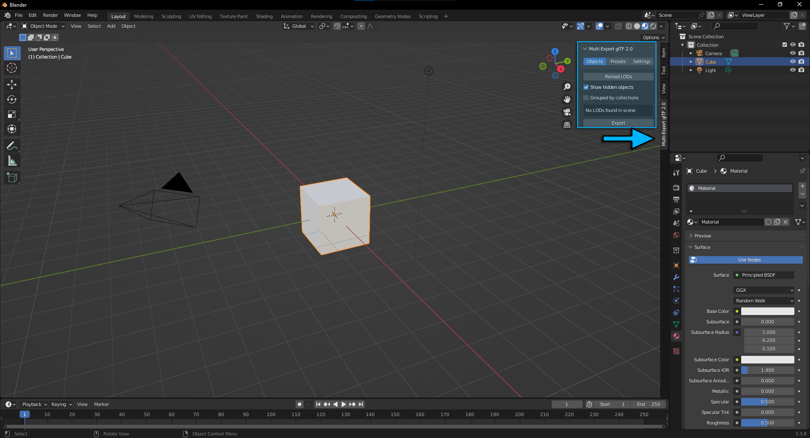

- There are two ways to export your model, you can use the Objects View or the Presets View :

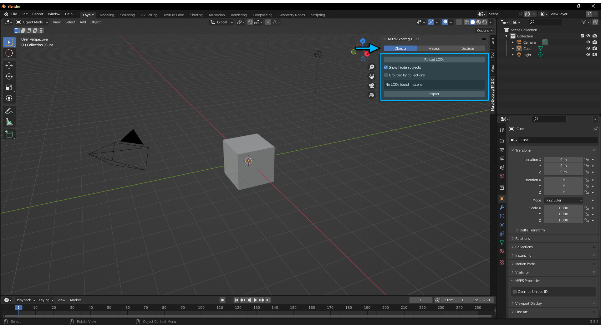

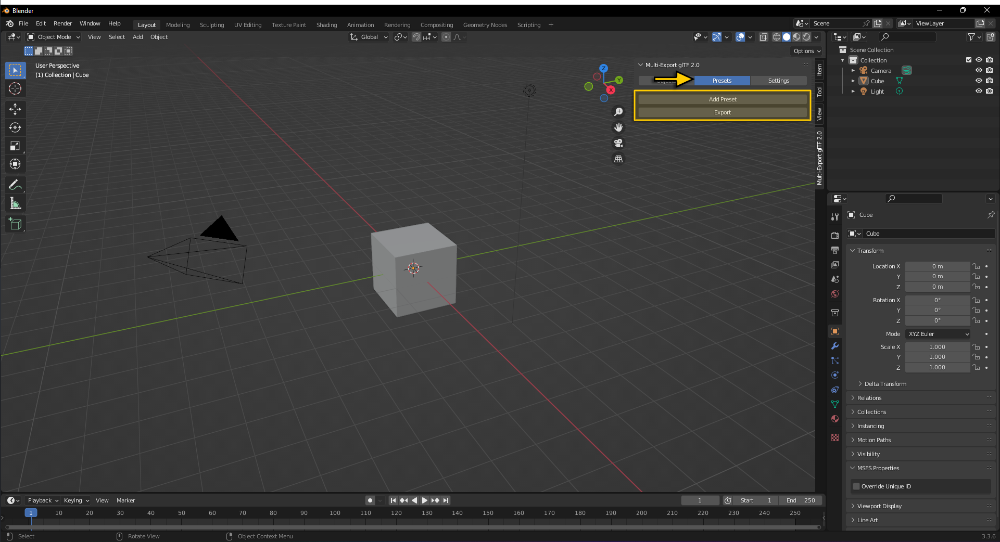

### Objects View :

This view relies on the names of your root nodes in your scene. If your object's name starts with x0_ or ends with \_LOD0 it will be considered a LOD0 ( x1_ and _LOD1 will be LOD1, and so on). The rest of its name defines its category so that all the objects from the same family (ie: different LODs of the same asset) will be sorted together.

If you click on "Reload LODs" button, it will group your objects with LOD(s) as shown down bellow:

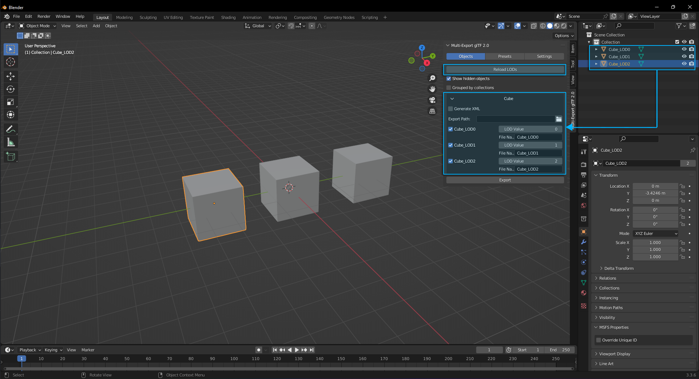

You need to set an export path that defines where you want to export your LOD(s):

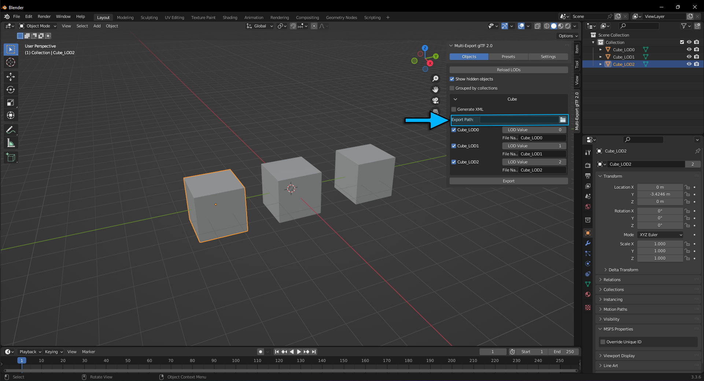

If you tick "Generate XML" checkbox, it will create the XML file for the families of LOD selected. For example selecting Cube, Cube_LOD0 or all of Cube's LODs will produce the same result and generate one file "Cube.XML" for the Cube family. You can also work with multiple families at once.

#### Example:
```
    <?xml version="1.0" encoding="utf-8"?>
        <ModelInfo guid="{1b7127b5-7223-4980-8cc0-3b5417cb2412}" version="1.1">
            <LODS>
                <LOD minSize="0" ModelFile="Cube_LOD0.gltf"/>
                <LOD minSize="1" ModelFile="Cube_LOD1.gltf"/>
                <LOD minSize="2" ModelFile="Cube_LOD2.gltf"/>
            </LODS>
        </ModelInfo>
```

### Presets View :
The Presets View allows you to create Export Presets that will make it easier to export a large numbers of objects, animations and more. This exporter relies on Collections to be selected and added to a Preset, so you will need your scene to be split into relevant collections.

When you click on "Add Preset" Button, a new element will be added to the view (see figure down bellow). You can set it's name, export folder and enable it for export.

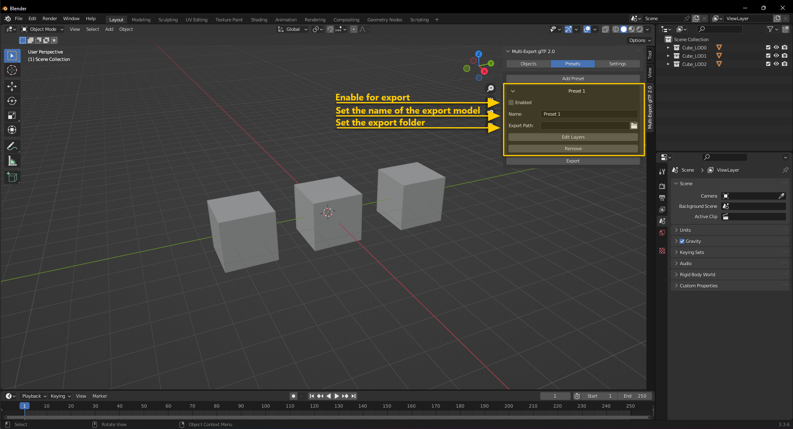

You will need to define which collections are applied to this Preset by clicking on "Edit Layers" Button:

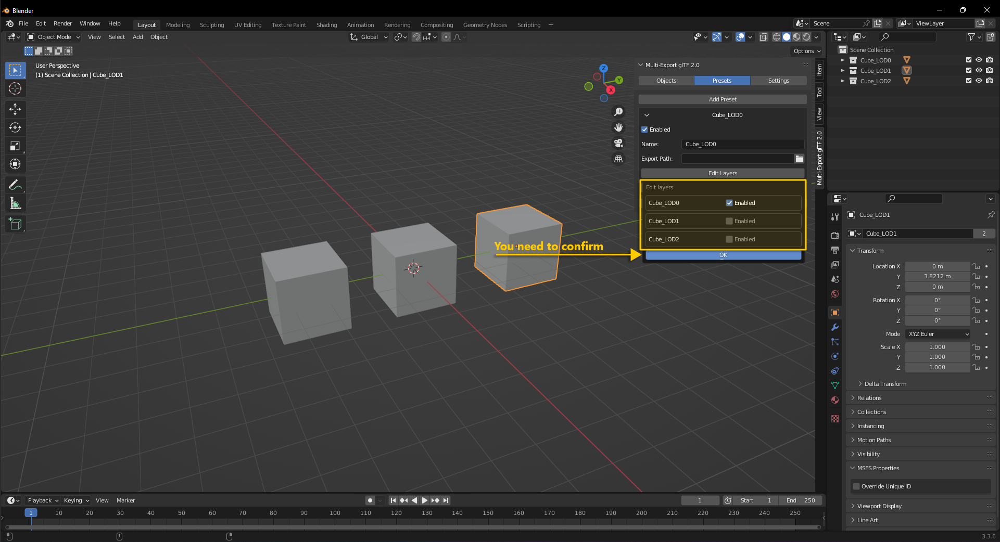

When all your presets are set up you can click on "Export" Button:

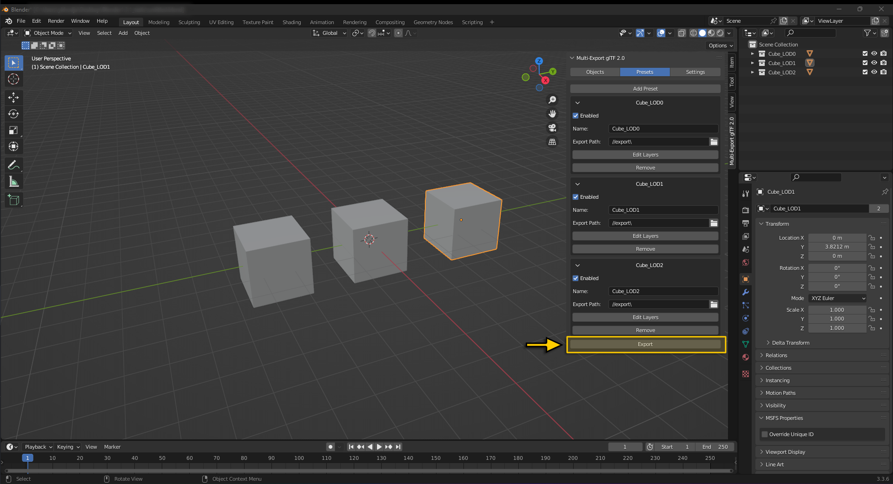

## Settings View :
Here you can find the various export settings (geometry, animations, materials...etc) from the glTF export in Blender. You can disable the Microsoft Flight Simulator Extensions if you want to export your models as pure glTF(s) following the Khronos Schemas.

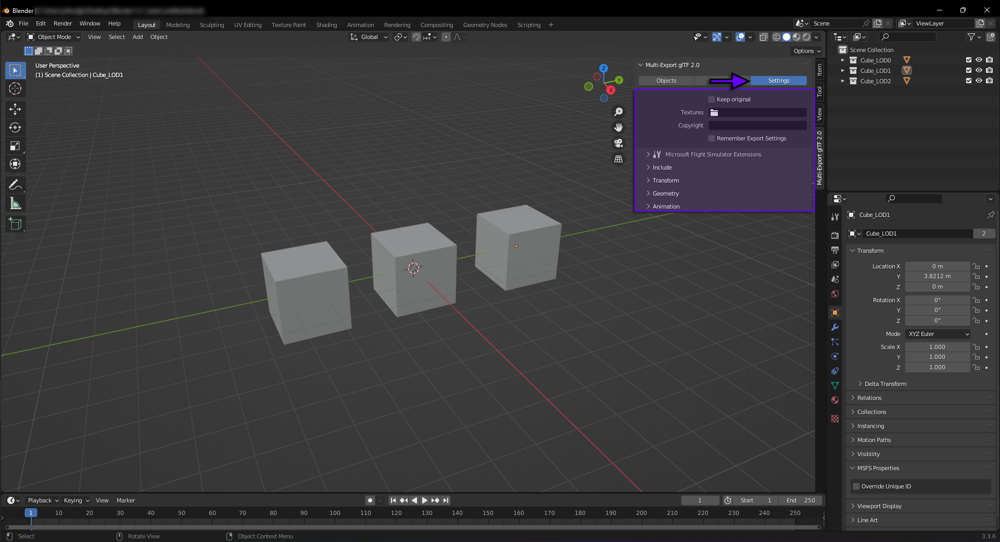
