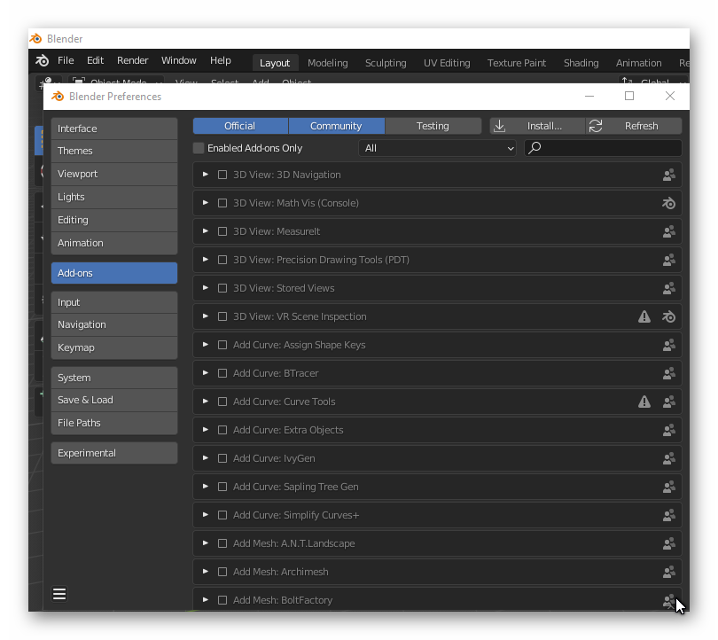

FlightSim Blender glTF 2.0 Importer and Exporter
======================================

This repository represents an alpha version of the official FlightSim-Blender Import/Export plugin. The flight sim community has already developed and forked the original project many times, and Asobo's intention is to fully support Blender with the contributions of all the developers that already developed many features in different unofficial Blender plugins.

Asobo especially thanks:

Vitus of [Wing42](https://wing42.com/), [tml1024](https://github.com/tml1024), [ronh991](https://github.com/ronh991), [pepperoni505](https://github.com/pepperoni505) of [FlyByWire](https://flybywiresim.com/)

Installation
===========
Option 1

1. Download the latest release
2. Decompress the file
3. Open the `addons` folder
4. Copy-paste the `io_scene_gltf2_msfs` folder into your Blender installation's `scripts/addons/` folder.
   1. Windows: this will usually be in `C:\Program Files\Blender Foundation\Blender 3.1\3.1\scripts\addons\`.
   2. Mac OS X: this will be in your Library (Press the Option key when in Finder's `Go` menu to open your Library folder): `\Users\<username>\Library\Application Support\Blender\3.1\scripts\addons\`.
   
Option 2

1. Download the latest release
2. Decompress the file
3. Open the `addons` folder
4. Use windows file manager and right-click on the `io_scene_gltf2_msfs` folder and send to compressed file.
   Use the zip file as the source for the install in Blender menu Edit Preferences (Add-on) - Install.
   If you had a previous version, first remove that version by using the add-on remove button inside the add-on.
   Close Blender and then reopen Blender to flush any cached data.
   Open the Edit|Preferences menu again. Select the install option and navigate to the zip file you just created.
   Install this zip file.
   Enable the addon by checking the checkbox.
   Close the preferences dialog

Migration of Legacy blend file MSFS Material types/modes
========================================================

Every effort has been made to allow legacy blend files to be used by this exporter.
The legacy blend files contain data that is used to create gltf ver 2.0 files
for use in the Microsoft Flight Simulator.  The ASOBO version of the exporter uses the
Khronos default code and adds hooks to this code for the ASOBO extensions used in the gltf files.
The legacy exporter was hard coded with the required extensions.
The ASOBO exporter has a much more complex and versitile material node structure that is
seen in the Shader tab/window in Blender.  Your legacy MSFS Material mode/types can be migrated 
to the new ASOBO MSFS material mode/types with the click of the "Migrate Material Data" button
in the MSFS Material Params panel under the Blender Material Properties. 

You should look at your shader nodes in your original blend file and make sure the bsdf node paramerters 
are the same as the panel values.  These can get out of synch when you modify the parameters in the "Surface"
section of the "Material Properties" panel instead of the "MSFS Material Params" section.  Pay particular attension
to Metallic Scale/Factor and Roughness Scale/Factor.
Steps:
- 1. Open your blend file.

- 2. Select a node/mesh

- 3. Open the MSFS Material Params Panel in the Material Properties
  - You will see a "Migrate Material Data" button above the MSFS Material Params type drop down list.
  - DO NOT Select a MSFS Material from the drop down, this will erase the existing legacy
data and you will lose all your material settings.
- 4. Click on the "Migrate Material Data" button
  - Your existing legacy material type/mode will be conoverted to the new ASOBO MSFS material type 
shader node structure.

Figure 1 Before migration

Figure 2 After Migration

All the settings from the legacy node structure are copied to the ASOBO exporter shader node structure. 
The pictures show the ASOBO node structure is more complex and there are a lot more nodes.  
Sometimes some model developers have made changes to the legacy bsdf node that are not reflected 
in the MSFS Material Params panel data. The variables that are migrated come from the legacy panel 
data, so there may be situations where your material will not look correct.  You will need to 
compare your legacy blend file materials to the new blend file Materials. Open your legacy blend file in 
another blender program and compare the MSFS Material Params panel values.  Adjust the parameters acordingly.

Each MSFS material will need to be migrated, but any mesh/nodes associated to that material 
will be also have it's MSFS Material Params migrated. 

You may also notice that some MSFS Material Parameters show data but cannot be adjusted. This is in
keeping with the ASOBO 3DS Max exporter material parameters.  Raise an issue if this is not to your requirements.

WARNING
=======

After migration SAVE YOUR FILE AS A NEW FILE and keep your legacy blend file for future reference.

