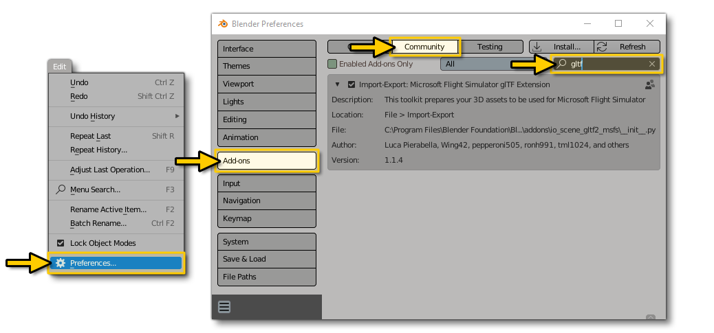

# FlightSim Blender glTF 2.0 Importer and Exporter

 

This repository contains the current version of the official Microsoft Flight Simulator Blender Import/Export plugin. The flight sim community has already developed and forked the original project many times, and Asobo's intention is to fully support Blender with the help and contributions of all the developers that have already implemented features in the different unofficial Blender plugins.

Asobo would especially like to thank the following people:

Vitus of [Wing42](https://wing42.com/), [tml1024](https://github.com/tml1024), [ronh991](https://github.com/ronh991), [pepperoni505](https://github.com/pepperoni505) of [FlyByWire](https://flybywiresim.com/)

**NOTE:** This plugin cannot import glTF files that have been built into a Microsoft Flight Simulator package through the sim's Package Builder.
 
  

# Installation

To install the Blender plugin please follow these simple steps:

1. Close Blender if you have it open.
2. Download the `glTF-Blender-IO-MSFS-<version>.zip` file.
3. Decompress the contents of the file to a temporary location.
4. Go to the `addons` folder and select the `io_scene_gltf2_msfs` then copy it to the clipboard (Ctrl + "C").
5. Now browse to the Blender `addons` folder, which - by default - can be found in the following locations:
   - **Windows**: this will usually be in `%AppData%\Blender Foundation\Blender\3.1\scripts\addons\`.
   - **Mac OS X**: this will be in your Library (Press the *Option* key when in Finder's `Go` menu to open your Library folder): `\Users\<username>\Library\Application Support\Blender\3.1\scripts\addons\`.
6. Paste the `io_scene_gltf2_msfs` into the Blender `addons` folder (Ctrl + V).

After completing the process outlined above, you will need to start Blender and then activate the plugin. Activation is done from the Blender Preferences, as shown in the image below:

**NOTE**: You may need to restart Blender again after activating the plugin for all the options to be visible in the IDE.

 

# Migration of Legacy Blend File Material Types/Modes

This Blender addon is now the officially supported addon for Microsoft Flight Simulator, and as such, blend files that were made using any other version/iteration of the addon are now considred *legacy* blend files. Basically, legacy blend files had the extensions that are used to create glTF ver 2.0 files for use in the Microsoft Flight Simulator hard-coded into them. However, the ASOBO version of the exporter uses the Khronos default code and adds hooks to this code for the ASOBO extensions used in the glTF files.

The ASOBO exporter also has a much more complex and versitile material node structure that can be seen in the Shader tab/window in Blender. Your legacy flight simulator material mode/types should be migrated to the new ASOBO Microsoft Flight SImulator material mode/types with the click of the "**`Migrate Material Data`**" button
in the MSFS Material Parameters panel (under the Blender Material Properties). 

We have made every effort possible to ensure that legacy blend files can be easily and fully migrated to use this addon and exporter, and we recommend the migration to use this addon as soon as possible to ensure future compatibility as this addon evolves and is updated. 

Once you have performed a migration, you should look at the shader nodes in your *original* blend file and make sure the BSDF node paramerters are the same as the panel values.  This is an important check to make as these can get out of sync when you modify the parameters in the `Surface` section of the `Material Properties` panel instead of modifying them in the `MSFS Material Parameters` section. In particular, pay attention to the *Metallic* and *Roughness* Scale and Factor values.

 

## Steps For Migration

1. Open your blend file.
2. Select a node/mesh
3. Open the `MSFS Material Params` Panel in the Material Properties
    - You will see a `Migrate Material Data` button above the MSFS Material Params type drop down list.
    - **DO NOT Select a MSFS Material from the drop down**, this will erase the existing legacy data and you will lose all your material settings.
4. Click on the "Migrate Material Data" button
    - Your existing legacy material type/mode will be conoverted to the new ASOBO MSFS material type shader node structure.

Figure 1 Before migration

Figure 2 After Migration

All the settings from the legacy node structure are copied to the ASOBO exporter shader node structure. As you can see from the images above, the ASOBO node structure is more complex and there are a lot more nodes. Sometimes some model developers have made changes to the legacy BSDF node that are *not* reflected in the `MSFS Material Params` panel data - the variables that are migrated come instead from the *legacy* panel data, so there may be situations where your material will not look correct. This means that you will need to compare your legacy blend file materials to the new blend file Materials after migration to see if there are any issues like this one. You can do this by openeing another Blender instance and opening the legacy file in that, then comparing the MSFS Material Params panel values with the legacy parameter values and adjusting them accordingly.

Note that each Microsoft Flight Simulator material will need to be migrated, but any mesh/nodes associated to that material will also have it's MSFS Material Parameters migrated. 

Finally, you may also notice that some MSFS Material Parameters show data but *cannot* be adjusted. This is in keeping with the ASOBO 3DS Max exporter material parameters.  Please raise an issue if this is not to your requirements.

 

## WARNING
After migration SAVE YOUR FILE AS A NEW FILE and keep your legacy blend file for future reference.

 

## Notes On Shadertree

Shadertree modification directly impacts the result of the exporter. 

If you work with an MSFS Material you should never modify the shader tree manually.

The properties of your material must only be modified through the `MSFS Material Panel` section
