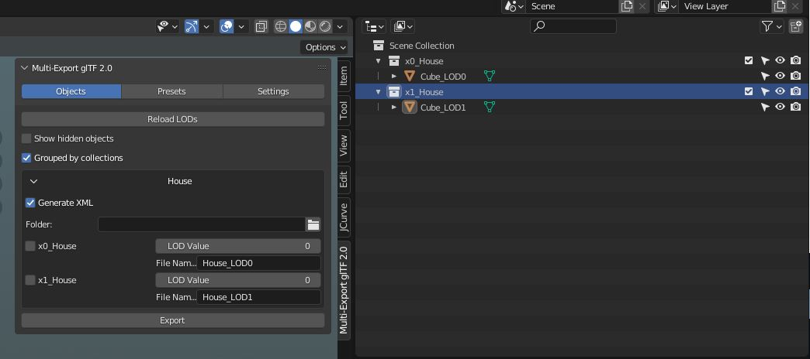

FlightSim Blender glTF 2.0 Importer and Exporter
======================================

This repository represents an alpha version of the official FlightSim-Blender Import/Export plugin. The flight sim community has already developed and forked the original project many times, and Asobo's intention is to fully support Blender with the contributions of all the developers that already developed many features in different unofficial Blender plugins.

Asobo especially thanks:

Vitus of [Wing42](https://wing42.com/), [tml1024](https://github.com/tml1024), [ronh991](https://github.com/ronh991), [pepperoni505](https://github.com/pepperoni505) of [FlyByWire](https://flybywiresim.com/)

# how to
## install
1. download the latest release
2. extract the zip file
3. go to %appdata% and move to \Blender Foundation\Blender\3.1\scripts\addons
4. paste this folder from the downloaded zip to the location in 3. /glTF-Blender.IO.MSFS-1.1.2/addons/io_scene_gltf2_msfs
5. start blender go to the preferences and to the addons
6. search microsoft and activate the exporter
7. you find the exporter in the "n" key panel.

## export a model with LOD
The combinations of the LOD files are generated by the name of the objects. For example if you have a cube
- cube_LOD0
- cube_LOD1

the exporter recognizes that these two cubes belong together and that there are 2 different LODs.

if you have multiple objects inside one LOD you can use collections to group them. The name of the collections should be like the cube above.

In order to work with collections you will have to check "Grouped by collections" in the "Objects" tab.

There is another naming convention for the LODs that will be recognized by the exporter:
- x0_cube
- x1_cube

In the Screenshot you find both ways combined. If you use the collection approach the cubes dont need the _LOD suffix.
